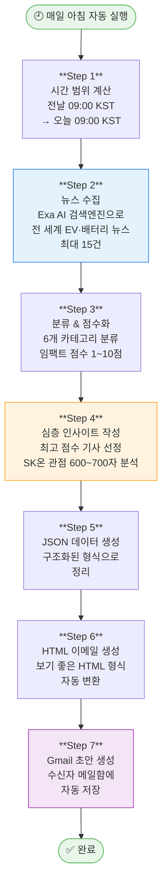
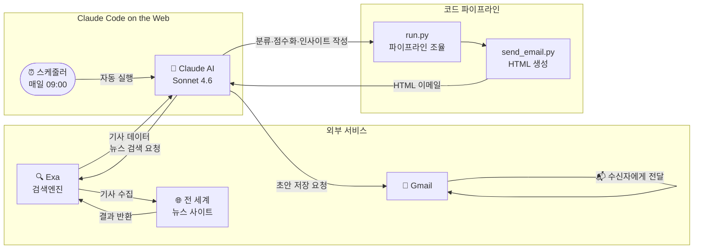

# 📰 AI 뉴스 브리핑 루틴 소개

> **"매일 아침 9시, AI가 EV·배터리 업계 핵심 뉴스를 자동으로 정리해 이메일로 보내줍니다."**

---

## 🤔 왜 만들었나요?

EV·배터리 업계는 하루가 다르게 빠르게 변합니다.  
CATL의 신기술 발표, 경쟁사 수주 소식, 미국 IRA 정책 변화 등  
매일 수십 개의 뉴스를 직접 찾아 읽고 정리하는 건 시간이 너무 많이 걸립니다.

이 루틴은 그 과정을 **완전히 자동화**합니다.  
사람이 아무것도 하지 않아도, 매일 아침 정해진 시간에 AI가 알아서 뉴스를 찾고 → 분류하고 → 요약하고 → 메일로 보내줍니다.

---

## ✉️ 최종 결과물 — 이런 이메일이 옵니다

```
제목: [AI Morning Brief] 2026-06-17 배터리 (EV/ESS) 핵심 동향

┌─────────────────────────────────────────────────────────┐
│  📰 AI Morning Brief — 2026-06-17                       │
│  EV · 배터리 · ESS 핵심 동향 | AI 자동생성 브리핑        │
├──────────────┬──────────────────────────────────────────┤
│ 카테고리      │ 제목 / 요약                               │
├──────────────┼──────────────────────────────────────────┤
│ ESS/에너지저장│ ESS oversupply takes hold...             │
│ SK온/경쟁사  │ CATL·BYD 비중국 시장까지 흔든다...        │
│ EV Maker     │ GM's Sodium-Ion Batteries...             │
│ ...          │ ...                                      │
├──────────────┴──────────────────────────────────────────┤
│ 🔍 주목 기사 인사이트 (600~700자 심층 분석)               │
│                                                         │
│ **배경**                                                 │
│ 전기차 수요 침체가 장기화되면서...                         │
│                                                         │
│ **핵심 내용**                                            │
│ 올해 ESS 생산능력 증가분은 **약 109GWh**...               │
│ ...                                                     │
└─────────────────────────────────────────────────────────┘
```

---

## ⚙️ 전체 동작 흐름



---

## 🧩 어떤 기술을 사용했나요?

이 루틴은 크게 **3가지 핵심 기술**의 조합으로 만들어졌습니다.

### 1. Claude Code on the Web — AI 자동화 플랫폼

```
일반 챗봇과의 차이점:

  일반 챗봇           Claude Code on the Web
  ─────────          ──────────────────────
  사람이 질문 →       스케줄 설정 → 자동 실행
  AI가 답변           AI가 직접 도구를 사용해
                      실제 작업을 수행
```

Claude Code는 단순히 대화하는 AI가 아닙니다.  
**정해진 시간에 자동으로 실행**되고, 인터넷 검색·파일 생성·이메일 발송 같은  
실제 작업을 직접 수행할 수 있습니다.

이 루틴은 **Routine(루틴) 기능**을 사용해  
매일 아침 9시에 사람 개입 없이 자동으로 실행됩니다.

---

### 2. MCP (Model Context Protocol) — AI의 팔과 다리

```
MCP를 쓰기 전:              MCP를 쓴 후:

  AI                          AI
  │                           │
  │ (텍스트만 생성 가능)        ├── 🔍 Exa MCP → 인터넷 검색
  │                           ├── 📧 Gmail MCP → 이메일 발송
  │                           ├── 📅 Google Calendar MCP → 일정 관리
  │                           └── ... 기타 외부 서비스
```

MCP는 AI가 외부 서비스를 직접 사용할 수 있게 해주는 **표준 연결 규격**입니다.  
USB처럼 다양한 서비스를 AI에 꽂아서 쓸 수 있다고 생각하면 됩니다.

이 루틴에서 사용한 MCP:

| MCP 서버 | 역할 | 실제 하는 일 |
|----------|------|------------|
| **Exa MCP** | 뉴스 수집 | AI 특화 검색엔진으로 EV·배터리 관련 최신 뉴스를 전 세계에서 수집 |
| **Gmail MCP** | 이메일 발송 | 완성된 브리핑을 지정된 수신자의 Gmail 초안으로 자동 저장 |

---

### 3. Python 파이프라인 — 데이터 가공 공장

AI가 수집한 뉴스 데이터를 보기 좋은 HTML 이메일로 만들어주는 코드입니다.

```
수집된 뉴스 데이터 (JSON)
         │
         ▼
   ┌─────────────┐
   │  run.py     │  ← 전체 파이프라인 조율
   └──────┬──────┘
          │
          ▼
   ┌─────────────┐
   │send_email.py│  ← HTML 이메일 생성
   └──────┬──────┘     • ## 소제목 → 굵은 헤딩
          │             • **text** → 볼드 강조
          ▼
   완성된 HTML 이메일
```

---

## 🗂️ 뉴스 분류 기준

수집된 뉴스는 아래 6개 카테고리 중 하나로 자동 분류됩니다.

```
┌─────────────────────┬─────────────────────────────────────────┐
│ 카테고리             │ 포함 내용 예시                            │
├─────────────────────┼─────────────────────────────────────────┤
│ 🚗 EV Maker         │ 테슬라·현대·GM·포드·BYD 신차/전략 뉴스    │
│ 🔋 EV 배터리 기술/산업│ 전고체·LFP·소듐이온 등 기술 개발 동향     │
│ ⚔️ SK온/배터리 경쟁사 │ CATL·삼성SDI·LG에너지솔루션 시장 동향    │
│ 📜 에너지 정책/규제   │ IRA·FEOC·EU 배터리법 등 정책 변화        │
│ ⛏️ 배터리 광물/공급망 │ 리튬·니켈·코발트 가격, 광산 개발 소식     │
│ 🏭 ESS/에너지저장    │ 대규모 에너지저장장치 시장·기술 동향       │
└─────────────────────┴─────────────────────────────────────────┘
```

---

## 📊 임팩트 점수란?

AI가 각 기사에 **1~10점**의 임팩트 점수를 자동으로 부여합니다.

```
점수 산정 기준:

  산업 전반 영향력   +   SK온 직접 관련성   +   시장/정책 파급력
        │                     │                      │
   이 뉴스가          SK온에게 직접적인        주가·매출·정책에
   업계 전체에        영향을 미치는가?         얼마나 큰 파급력이
   얼마나 중요한가?   (공급 계약, 경쟁사       있는가?
                      동향 등)
```

가장 높은 점수를 받은 기사가 **심층 인사이트 분석 대상**으로 선정됩니다.

---

## 📝 심층 인사이트 구성

최고 임팩트 기사에 대해 AI가 4개 섹션으로 600~700자 분석을 작성합니다.

```
┌──────────────────────────────────────────┐
│  ## 배경                                  │
│  왜 이 뉴스가 나왔는가?                    │
│  (업계 흐름, 사건의 배경 설명)             │
├──────────────────────────────────────────┤
│  ## 핵심 내용                             │
│  무슨 일이 일어났는가?                     │
│  (핵심 사실, 수치, 주요 내용 요약)          │
├──────────────────────────────────────────┤
│  ## 산업 영향                             │
│  EV/배터리 산업 전반에 어떤 의미인가?       │
│  (시장 구조 변화, 경쟁 구도 분석)           │
├──────────────────────────────────────────┤
│  ## SK온 관점에서의 시사점                 │
│  우리에게 기회인가, 위협인가?               │
│  (SK온 전략과 연결한 구체적 시사점)         │
└──────────────────────────────────────────┘
```

---

## 🏗️ 전체 시스템 구조



---

## 📁 코드 파일 구성

```
Claude-web/
├── daily_briefing/
│   ├── run.py          ← 전체 파이프라인 실행 (진입점)
│   ├── send_email.py   ← HTML 이메일 빌더
│   ├── fetch_news.py   ← 시간 범위 계산 유틸리티
│   ├── config.py       ← 수신자 이메일, 카테고리 등 설정값
│   ├── render.py       ← Word 문서 렌더러 (선택적 사용)
│   └── insight.py      ← 인사이트 유틸리티
└── CLAUDE.md           ← AI 행동 가이드라인
```

---

## 🔄 향후 개선 가능한 것들

| 기능 | 설명 |
|------|------|
| 날짜 필터 강화 | 24시간 범위 밖 기사 자동 제외 (현재 프롬프트 개선 진행 중) |
| 다국어 수집 | 영어·한국어·중국어 뉴스 동시 수집 |
| 채널 확장 | 이메일 외 Slack·Teams 알림 추가 |
| 모니터링 대상 확장 | 배터리 외 다른 산업군으로 확장 |
| 개인화 | 팀원별 관심 분야에 맞춘 맞춤형 브리핑 |

---

<br>

> 💡 **한 줄 요약**  
> Claude AI가 매일 아침 스스로 뉴스를 찾고, 읽고, 분류하고, 분석해서 이메일로 보내주는 **완전 자동화 인텔리전스 파이프라인**입니다.

